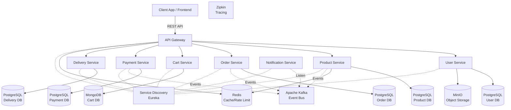

# MilHub Microservices Platform

*Looking for the frontend? The React UI repository can be found here: [MilHub Frontend](https://github.com/rostikdiv/milhub-frontend.git)*

MilHub is a robust, enterprise-grade handmade marketplace built using a microservices architecture. It is designed to demonstrate advanced backend capabilities including distributed systems, event-driven architecture, and modern deployment strategies.

## 🛠️ Tech Stack
- **Core**: Java 17, Spring Boot 3.5.7, Spring Cloud
- **Security**: Spring Security, JJWT 0.12.5 (BCrypt password hashing)
- **Databases**: PostgreSQL 16 (Relational), MongoDB 7.0 (Document)
- **Messaging & Event Bus**: Apache Kafka 7.5.0 (Confluent Platform), Zookeeper
- **Caching & Rate Limiting**: Redis 7.2
- **Storage**: MinIO (S3-compatible)
- **Observability**: Prometheus, Grafana, Zipkin

## 🏗️ Architecture

The system consists of 9 core microservices interacting through an API Gateway and an Event Bus (Kafka).

### Architecture Diagram



## 🧠 Architectural Patterns Used

1. **Database-per-Service**: Each microservice manages its own exclusive database to ensure loose coupling and independent scalability. The project uses PostgreSQL for relational data and MongoDB for dynamic document storage (Cart Service).
2. **Event-Driven Architecture (EDA)**: Services communicate asynchronously via Apache Kafka. For example:
   - When an order is created, `order-service` publishes an `OrderPlacedEvent`. This is independently consumed by the `notification-service` (for emails) and the `delivery-service` (to initiate logistics).
   - The `product-service` publishes events (e.g., `ProductInventoryUpdatedEvent`) when stock changes, allowing other domains to react dynamically.
   - The `payment-service` publishes `PaymentCompletedEvent` or `PaymentFailedEvent` after processing, which `order-service` listens to in order to update the final order status.
3. **Hybrid Sync/Async Approach**: While EDA is the primary communication pattern, the architecture pragmatically blends synchronous REST calls (via OpenFeign) for critical validations that require immediate feedback—such as the `order-service` synchronously checking inventory in the `product-service` before confirming an order checkout. Post-processing is then offloaded asynchronously.
4. **API Gateway Pattern**: A single entry point (Spring Cloud Gateway) routes all client requests, providing centralized authentication validation, CORS handling, and Rate Limiting via Redis.
5. **Service Discovery**: Spring Cloud Netflix Eureka is used for dynamic routing, allowing services to find each other without hardcoded IP addresses.

## 📦 Core Services

| Service | Responsibility | Database / Storage | Port |
|---------|----------------|-------------------|------|
| **api-gateway** | Entry point, Routing, Rate Limiting, Security Validation | Redis | `8080` |
| **service-discovery** | Service Registry (Eureka) | None | `8761` |
| **user-service** | Auth, Profiles, Roles, Verification | PostgreSQL | `8081` |
| **product-service** | Catalog, Inventory, Search | PostgreSQL, Redis | `8082` |
| **order-service** | Order processing, Lifecycle management | PostgreSQL | `8083` |
| **cart-service** | Shopping cart sessions | MongoDB | `8084` |
| **payment-service** | Processing transactions | PostgreSQL | `8085` |
| **delivery-service** | Shipping, Logistics, Tracking | PostgreSQL | `8086` |
| **notification-service** | Email/SMS alerts (Kafka consumer) | None | `8087` |

## 🔒 Security

The platform implements **Stateless JWT Authentication**. 
- Users have distinct roles: `BUYER`, `SELLER`, and `ADMIN`.
- Passwords are securely hashed using **BCrypt** before entering the database.
- The `api-gateway` validates the JWT signature and expiration, then forwards the roles to downstream services via HTTP headers, meaning downstream services don't need to depend on the Auth database.

**How to get a Token (Testing):**
```bash
curl -X POST http://localhost:8080/api/v1/auth/login \
  -H "Content-Type: application/json" \
  -d '{"email": "admin@milhub.com", "password": "password123"}'
```
*Copy the `token` from the response and use it as an `Authorization: Bearer <token>` header in subsequent requests.*

> **⚠️ IMPORTANT:** The `admin@milhub.com` account is a Master Admin automatically initialized upon startup for testing purposes. **You must change this default password immediately** in a production environment.

## 🛡️ Fault Tolerance (Resilience4j)

To prevent cascading failures across the distributed system, **Resilience4j** is utilized:
- **Circuit Breaker**: Used in the `order-service` when it synchronously calls the `product-service` to check inventory. If the product service is down, the circuit opens, failing fast rather than hanging and consuming threads.
- **Retry**: Applied to ephemeral network issues (e.g., calling the simulated 3rd party APIs in `payment-service`). *Note: The `payment-service` in this repository is a mock implementation designed to simulate transaction success/failure without hitting a real payment provider like Stripe.*
- **Rate Limiter**: Configured at the `api-gateway` level (backed by Redis) to prevent DDoS attacks and API abuse.

## 👁️ Observability & Monitoring

Distributed tracing and monitoring are essential for debugging microservices. I implemented a comprehensive approach:
- **Prometheus & Grafana**: Prometheus (accessible on `http://localhost:9090`) scrapes metrics from every service's `/actuator/prometheus` endpoint. Grafana (accessible on `http://localhost:3000`) visualizes these metrics (CPU, Memory, HTTP request latency) on rich dashboards.
- **Zipkin (Local Development)**: Provides a quick, Docker-based UI (`http://localhost:9411`) to visualize trace spans across services locally.
- **AWS X-Ray (Production-Ready)**: The codebase is instrumented and ready to export telemetry to AWS X-Ray using OpenTelemetry for robust cloud observability.

## 💾 Storage (MinIO)
**MinIO** is used as an S3-compatible Object Storage server. 
- **Purpose**: It stores all unstructured binary data, such as user avatars, seller verification documents, and product images.
- **Why**: Keeps the relational databases lightweight and prepares the app for a seamless migration to AWS S3 in production.

## 📖 API Documentation (Swagger)
Each microservice is individually documented using `springdoc-openapi`. 
The API Gateway is configured to aggregate these docs, but you can also access each service's Swagger UI directly:
- **API Gateway (Aggregated)**: `http://localhost:8080/swagger-ui.html`
- **User Service (Direct)**: `http://localhost:8081/swagger-ui.html`
- **Product Service (Direct)**: `http://localhost:8082/swagger-ui.html`
- *(Pattern repeats for all other core services)*

## 🧪 Testing

- **Unit & Slice Tests**: I heavily rely on Spring Boot's testing slices (`@WebMvcTest` for controllers, `@DataJpaTest` for repositories) combined with JUnit 5 and Mockito to ensure fast, isolated testing of business logic.
- **Integration Tests (Testcontainers)**: I use Testcontainers to spin up real PostgreSQL, Kafka, and Redis Docker instances during the Maven `test` phase. This ensures the repository layer and message brokers are tested against real environments, not just mocks.

## ⚙️ Environment Variables & Secrets
I strictly adhere to the 12-Factor App methodology. **No secrets are hardcoded in the repository.**
- Local development relies on `.env` files (e.g., `POSTGRES_PASSWORD`, `JWT_SECRET`). 
- Simply copy the provided `.env.example` to `.env` and fill in your values before running Docker Compose.
- `application.yml` leverages Spring Profiles (`dev`, `prod`, `docker`) to inject these variables dynamically.

## 🚀 Getting Started (Local Deployment)

To run the entire MilHub platform locally, you will need Docker and Docker Compose.

### 1. Start the Infrastructure
Use Docker Compose to bring up all infrastructure containers (Databases, Kafka, Zookeeper, Redis, MinIO, Zipkin, Prometheus, Grafana):
```bash
docker-compose up -d
```

### 2. Start the Microservices
You can run the microservices using your IDE or via Maven. 
**Important**: The `service-discovery` (Eureka) must be started first.
1. Run `service-discovery` (Wait until it starts on port 8761)
2. Run `api-gateway`
3. Run all other services (`order`, `product`, `user`, etc.)

## 🩺 Health Checks
Since the project uses Spring Boot Actuator, every microservice exposes a health endpoint.
- Example: `http://localhost:8081/actuator/health`

## 🔄 CI/CD
This repository includes a GitHub Actions pipeline (`.github/workflows`) that automatically builds the Maven projects, runs the Testcontainers integration tests, and verifies code quality on every Pull Request.
Additionally, there is a `deploy.yml` pipeline configured for Amazon ECS deployment. This file is **currently commented out** and safely committed, as it is strictly intended for the final production deployment phase in AWS. No secret keys are hardcoded in it (it relies purely on GitHub Secrets).

## 🔧 Troubleshooting

**Q: Services keep crashing on startup with connection errors!**
> A: This is a common "Crash Loop". Microservices depend on infrastructure like Kafka, Zookeeper, and PostgreSQL. If you start the Java services *before* Docker finishes initializing Kafka, the services will fail. **Solution**: Run `docker-compose up -d`, wait ~30 seconds for all containers to become fully healthy, and then start your Java apps.

## 📄 License
This project is licensed under the MIT License - see the LICENSE file for details.
