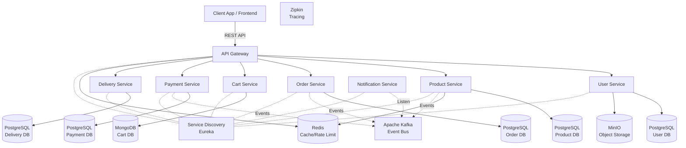

# CraftHub Microservices Platform

CraftHub is a robust, enterprise-grade e-commerce platform built using a microservices architecture. It is designed to demonstrate advanced backend capabilities including distributed systems, event-driven architecture, and modern deployment strategies.

## 🏗️ Architecture

The system consists of 9 core microservices interacting through an API Gateway and an Event Bus (Kafka).

### Architecture Diagram



## 🧠 Architectural Patterns Used

1. **Database-per-Service**: Each microservice manages its own exclusive database to ensure loose coupling and independent scalability. We use PostgreSQL for relational data and MongoDB for dynamic document storage (Cart Service).
2. **Event-Driven Architecture (EDA)**: Services communicate asynchronously via Apache Kafka. For example, when an order is created, `order-service` publishes an `OrderPlacedEvent`, which is independently consumed by `notification-service` and `payment-service`.
3. **API Gateway Pattern**: A single entry point (Spring Cloud Gateway) routes all client requests, providing centralized authentication validation, CORS handling, and Rate Limiting via Redis.
4. **Service Discovery**: Spring Cloud Netflix Eureka is used for dynamic routing, allowing services to find each other without hardcoded IP addresses.

## 🚀 Getting Started (Local Deployment)

To run the entire CraftHub platform locally, you will need Docker and Docker Compose.

### 1. Start the Infrastructure
First, bring up all databases (PostgreSQL, MongoDB), Kafka, Zookeeper, Redis, MinIO, and Zipkin. We have provided a PowerShell script for convenience:
```powershell
docker-compose up -d postgres-user-db postgres-payment-db postgres-delivery-db postgres-product-db postgres-order-db mongo kafka zookeeper zipkin service-discovery redis minio

```

### 2. Start the Microservices
You can run the microservices using your IDE or via Maven. 
**Important**: The `service-discovery` (Eureka) must be started first.
1. Run `service-discovery` (Wait until it starts on port 8761)
2. Run `api-gateway`
3. Run all other services (`order`, `product`, `user`, etc.)

### 3. Verify & Default Ports
* **Frontend (Vite/React)**: `http://localhost:5173`
* **API Gateway (Backend Entry Point)**: `http://localhost:8080`
* **Eureka Dashboard**: `http://localhost:8761`
* **Zipkin Tracing**: `http://localhost:9411`
