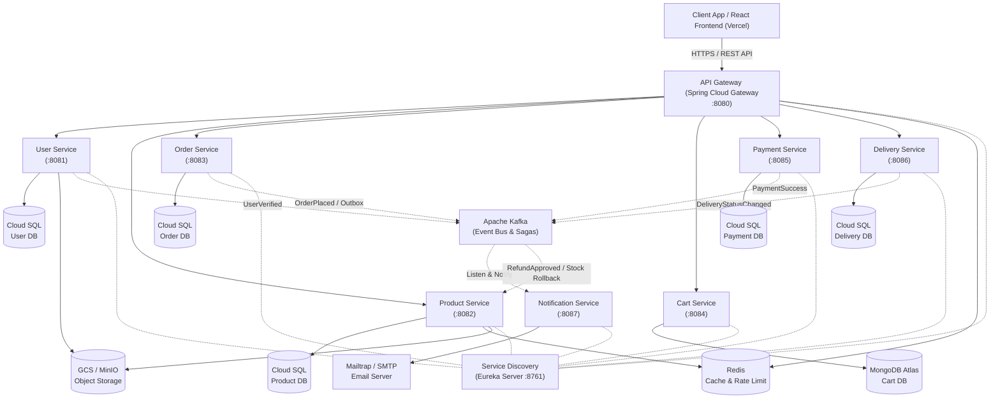

# 🛡️ MilHub Microservices Platform

[](https://github.com/rostikdiv/milhub-microservices/actions/workflows/deploy.yml)
[](https://www.oracle.com/java/)
[](https://spring.io/projects/spring-boot)
[](https://spring.io/projects/spring-cloud)
[](https://kafka.apache.org/)
[](https://www.postgresql.org/)
[](https://www.mongodb.com/)
[](https://redis.io/)
[](https://cloud.google.com/run)
[](https://vercel.com/)

* **Live Web Application (Frontend)**: [https://milhub-frontend.vercel.app](https://milhub-frontend.vercel.app)
* **Production API Gateway (Backend)**: [https://milhub-api-gateway-258044247462.us-central1.run.app](https://milhub-api-gateway-258044247462.us-central1.run.app)
* **Frontend Repository**: [https://github.com/rostikdiv/milhub-frontend.git](https://github.com/rostikdiv/milhub-frontend.git)

---

## 📖 Overview

**MilHub** is an enterprise-grade, distributed microservices platform engineered for military and defense logistics, tactical equipment procurement, and specialized military unit supply. 

The platform connects verified defense manufacturers, suppliers, and volunteer organizations with armed forces units. It features strict role-based access control, cryptographic verification for restricted items (`RESTRICTED`), transactional event-driven consistency, and serverless cloud scaling on Google Cloud Platform (GCP).

---

## 🛠️ Tech Stack

- **Backend Core**: Java 17, Spring Boot 3.5.7, Spring Cloud 2025.0.0
- **Service Discovery & Gateway**: Spring Cloud Netflix Eureka, Spring Cloud Gateway, OpenFeign
- **Security**: Spring Security 6, Stateless JWT (JJWT 0.12.5), BCrypt hashing
- **Messaging & Event-Driven Bus**: Apache Kafka 7.5.0, Zookeeper, Transactional Outbox Pattern
- **Databases**: 
  - PostgreSQL 16 (Relational: Users, Products, Orders, Payments, Delivery)
  - MongoDB 7.0 (Document: Shopping Cart sessions)
- **Caching & Rate Limiting**: Redis 7.2 (Spring Data Redis, Token Bucket Rate Limiter)
- **Object Storage**: 
  - Production: Google Cloud Storage (GCS) with HMAC credentials
  - Local Development: MinIO (S3-compatible)
- **Mail & Notifications**: Jakarta Mail, Angus Mail, Thymeleaf HTML Templates, Mailtrap SMTP (Port 587 STARTTLS)
- **Resilience**: Resilience4j (Circuit Breaker, Retry, RateLimiter)
- **Observability**: Spring Boot Actuator, Prometheus, Micrometer, Structured JSON Logging
- **Cloud & Deployment**: Google Cloud Run (Serverless), Google Artifact Registry (GAR), Google Cloud SQL, GCP VPC Network, GitHub Actions (OIDC CI/CD)

---

## 🏗️ Architecture

The system consists of **9 core microservices** collaborating via synchronous REST APIs (for instant query validations) and asynchronous Kafka event streaming (for business workflows and cross-service sagas).



---

## 🧠 Core Architectural Patterns

1. **Database-per-Service**: Each microservice strictly controls its private database schema, guaranteeing loose coupling, independent scalability, and domain boundary isolation.
2. **Transactional Outbox Pattern**: In `order-service`, event messages are persisted to an `outbox_events` relational table within the same database transaction as the order itself. A background Outbox Scheduler polls and publishes these events to Kafka, guaranteeing *at-least-once* delivery even during broker outages.
3. **Saga Orchestration & Stock Rollback**:
   - Order creation checks inventory and locks stock.
   - If an order return or cancellation is approved (`RefundApprovedEvent`), the `product-service` consumes the Kafka event and executes a compensating transaction to immediately restore stock inventory (`quantity + N`).
4. **Hybrid Sync/Async Processing**:
   - **Synchronous**: OpenFeign clients perform real-time stock checks and user verification clearance before checkout.
   - **Asynchronous**: Post-order processes (payment confirmation, logistics tracking updates, multi-template HTML email notifications) are offloaded through Kafka topics.
5. **Centralized API Gateway**: Manages JWT authentication validation, CORS policies, client IP rate limiting via Redis Token Bucket, and internal HTTP header propagation (`X-User-Id`, `X-User-Email`, `X-User-Roles`).

---

## 📦 Microservices Breakdown

| Service | Responsibilities | Storage / Tech | Local Port |
|:---|:---|:---|:---:|
| **`api-gateway`** | Central entry point, Routing, JWT Validation, Redis Rate Limiting | Redis 7.2 | `8080` |
| **`service-discovery`** | Service Registry and health heartbeats (Netflix Eureka) | In-Memory | `8761` |
| **`user-service`** | Authentication, Profile Management, Military & Seller Document Verification | PostgreSQL 16, GCS / MinIO | `8081` |
| **`product-service`** | Tactical Catalog, Stock Inventory, Restricted Access Controls, Reviews | PostgreSQL 16, Redis 7.2 | `8082` |
| **`order-service`** | Requisition processing, Outbox Table, Return Request lifecycle | PostgreSQL 16, Kafka Outbox | `8083` |
| **`cart-service`** | Temporary shopping cart sessions & fast document access | MongoDB 7.0 | `8084` |
| **`payment-service`** | Transaction simulations, payment receipt verification | PostgreSQL 16 | `8085` |
| **`delivery-service`** | Logistics dispatch, tracking codes, shipment status lifecycle | PostgreSQL 16 | `8086` |
| **`notification-service`** | Async Kafka listener, HTML Thymeleaf templates, Mailtrap SMTP dispatch | JavaMail (Angus), Mailtrap | `8087` |

---

## 🔒 Security & Role-Based Access Control (RBAC)

The platform implements stateless **JWT Authentication** with fine-grained access control:

* **`BUYER`**: Public defense catalog browsing, cart management, checkout for standard gear.
* **`MILITARY_UNIT`**: Verified military unit / officer account. Granted exclusive access to order **`RESTRICTED`** tactical equipment (drones, thermal optics, signal jammers, tactical body armor).
* **`SELLER`**: Verified defense vendor / manufacturer. Can publish inventory, configure clearance discounts, process orders, and review return requests in **Seller Studio**.
* **`ADMIN`**: Platform administration, verification queue moderation (military ID & seller KYC review), catalog oversight.

### Master Administrator Setup via Environment Variables

The initial system administrator account is provisioned dynamically on startup by the `user-service` `DataInitializer` using environment variables configured in your `.env` file:

```env
# System Administrator Configuration (.env)
ADMIN_EMAIL=admin@milhub.ua
ADMIN_PASSWORD=your_secure_admin_password
ADMIN_FIRST_NAME=System
ADMIN_LAST_NAME=Admin
```

> 🔒 **Security Notice:** Default admin credentials are never hardcoded in source code or database migrations. You can customize the administrator's email, password, first name, and last name in `.env` before starting the services. Production environments inject these credentials dynamically via **Google Cloud Secret Manager**.

### Authentication & Token Flow:

```bash
# Example Authentication Request
curl -X POST https://milhub-api-gateway-258044247462.us-central1.run.app/api/v1/auth/login \
  -H "Content-Type: application/json" \
  -d '{
    "email": "admin@milhub.ua",
    "password": "your_secure_admin_password"
  }'
```

---

## ☁️ Google Cloud Platform (GCP) Infrastructure

The production backend runs on a fully managed serverless infrastructure on **Google Cloud Platform**:

- **Google Artifact Registry (GAR)**: Private Docker registry storing built microservice container images (`us-central1-docker.pkg.dev/parkflow-cloud/milhub-repo`).
- **Google Cloud Run**: Serverless container execution with automated scaling, VPC egress connector, and zero idle overhead.
- **Google Cloud SQL**: Managed PostgreSQL 16 instance with automated backups and private VPC connectivity.
- **Google Cloud Storage (GCS)**: Secure buckets for encrypted military documents (`parkflow-cloud-documents-protected-storage`) and public media (`parkflow-cloud-avatars-storage`, product images).
- **CI/CD Pipeline**: GitHub Actions workflow ([.github/workflows/deploy.yml](.github/workflows/deploy.yml)) with Workload Identity Federation (OIDC) automating container builds, path filtering, and Cloud Run deployments.

---

## 💾 Database Seeding & Maintenance Scripts

The repository includes pre-built utility scripts and seed catalogs for immediate environment setup:

### 1. Database Seeder (`seed.js`)
Populates the database with realistic military hardware (thermal scopes, quadcopters, helmets, body armor), categories, user accounts, and test reviews.

```bash
# Seed local environment (http://localhost:8080/api/v1)
node seed.js local

# Seed production Cloud Run environment (via API Gateway)
node seed.js cloud
```

* **`seed-mega-catalog.json`**: Complete tactical product catalog with real specifications, prices, images, and clearance flags.
* **`seed-data.json`**: Initial category taxonomy, demo military units, suppliers, and customer profiles.
* **`generated_accounts.json`**: Auto-generated credentials reference file created by `seed.js` for testing.

### 2. Traffic & User Activity Simulator (`simulate-activity.js`)
Simulates realistic, lifelike activity on the platform:
* Provisions **15 buyer accounts**: 5 verified military units (`MILITARY_UNIT`) with defense clearance + 10 defense volunteers/buyers (`BUYER`).
* Generates **150 total orders** (10 orders per buyer) across public and restricted defense equipment.
* Executes instant payment webhook confirmation (`PAID`) and supplier fulfillment (`DELIVERED`).
* Publishes authentic, combat-tested **Field Reports & Reviews** (★ 4–5) that automatically receive the official **`Verified Purchase`** badge.

```bash
# Simulate traffic on local environment (http://localhost:8080/api/v1)
node simulate-activity.js local

# Simulate traffic on production Cloud Run (via API Gateway)
node simulate-activity.js cloud
```

### 3. Cloud Database Reset & Simulation Pipeline (`wipe-dbs.ps1`)
A complete maintenance script that safely restarts Cloud Run services, drops and recreates clean Cloud SQL databases, waits for Flyway schema migrations, executes `seed.js cloud`, and triggers `simulate-activity.js cloud`.

> [!IMPORTANT]
> **GCP Authentication Required**: Before running `./wipe-dbs.ps1`, ensure you have logged in to Google Cloud CLI and selected the target project:
> ```bash
> gcloud auth login
> gcloud config set project parkflow-cloud
> ```

```powershell
./wipe-dbs.ps1
```

### 4. Local Stack Launcher (`up-stack-for-services.ps1`)
Quickly spins up local infrastructure containers (PostgreSQL, MongoDB, Kafka, Zookeeper, Redis, MinIO, Zipkin):

```powershell
./up-stack-for-services.ps1
```

---

## 🚀 Local Development Quickstart

### Prerequisites
- Java 17 JDK
- Apache Maven 3.9+
- Docker & Docker Compose
- Node.js 18+ (for seeding scripts)

### Step 1: Clone Repository
```bash
git clone https://github.com/rostikdiv/milhub-microservices.git
cd milhub-microservices
```

### Step 2: Environment Configuration
Copy `.env.example` to `.env` and specify your credentials (including database passwords and the system administrator account details `ADMIN_EMAIL`, `ADMIN_PASSWORD`, `ADMIN_FIRST_NAME`, `ADMIN_LAST_NAME`):
```bash
cp .env.example .env
```

### Step 3: Start Local Infrastructure
```bash
docker-compose up -d
```

### Step 4: Run Microservices
Start services in the following order:
1. `service-discovery` (Wait for port `8761` to initialize)
2. `api-gateway` (Port `8080`)
3. Core microservices: `user-service`, `product-service`, `order-service`, `cart-service`, `payment-service`, `delivery-service`, `notification-service`

### Step 5: Seed Demo Data
```bash
node seed.js local
```

---

## 🧪 Testing & Code Quality

```bash
# Run unit & slice tests across all modules
mvn clean test

# Run tests for a single service
mvn test -pl notification-service
```

- **Unit & Slice Testing**: `@WebMvcTest`, `@DataJpaTest`, Mockito, JUnit 5.
- **Integration Testing**: Testcontainers for PostgreSQL, Kafka, and Redis in isolated Docker environments during Maven builds.

---

## 🗺️ Roadmap & Future Enhancements

- [ ] **mTLS Zero-Trust Service Mesh**: Mutual TLS between microservices using Istio.
- [ ] **AI-Powered Document OCR**: Automated pre-validation of military IDs and service certificates.
- [ ] **WebSocket Live Tracking**: Real-time push updates for requisition dispatches and delivery status.
- [ ] **Change Data Capture (CDC)**: Transition outbox polling to Debezium Kafka Connect for sub-millisecond event streaming.

---

## 📄 License

This project is licensed under the MIT License - see the [LICENSE](LICENSE) file for details.
